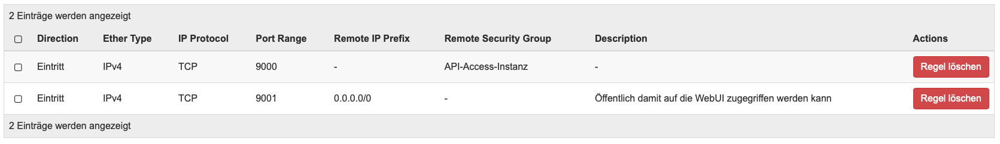
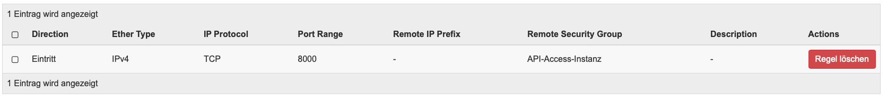

# OpenStack Project - Animal Detection Service

Animal Detection Service von Gruppe 3, Christoph Hiess und Maximilian Resch, bietet die Möglichkeit mittels einer API POST Anfrage und einem mitgesendeten Bild, Tiere die auf dem Bild abgebildet sind zu erkennen und diese Informationen in eine Datenbank einzutragen.

## Inhalt

- Architekturübersicht

- Installationsanleitung
  
  - Netzwerkkonfiguration
    
    - Netzwerk
    
    - Netzwerk Ports
    
    - Router
    
    - Sicherheitsgruppen
    
    - Floating IP's
  
  - Compute Instanzen erstellen
    
    - minio S3-Storage
    
    - mysql Datenbank
    
    - Image Detection Service
    
    - API-Gateway

- Service Testen

- Mögliche Probleme
  
  - Instanz starten ohne Sicherheitsgruppen
  
  - SSH Key nicht auf Instanz kopiert
  
  - "Internal Server Error" API-Anfrage

- Troubleshooting
  
  - API-Gateway
  
  - Image Detection

- Security Verbesserungen
  
  - Docker
  
  - Passwörter
  
  - Rate Limit API-Gateway

- Weitere Informationen
  
  - Docker Container bauen

- Referenzen

### Architekturübersicht

Das Image Detection Service bietet die Möglichkeit Objekte, spezifiziert auf Tiere, auf einem übermittelten Bild zu identifizieren und zu erkennen. Die Übertragung erfolgt mittels einer Anfrage an das API-Gateway. Dieser Service (API-Gateway) beinhaltet die gesammte Logik, nimmt das Bild entgegen, ladet es auf einen S3 Objekt Storage (Minio) hoch, sendet das Bild an den Image Detection Service und trägt die Ergebnisse mit dem Dateinamen in eine Datenbank ein.

ARCHITEKTURDIAGRAMM


> WICHTIG: Wir haben uns bei diesem Projekt auf die OpenStack Infrastruktur konzentriert, Sicherheitsfunktionen des Service wurden nachrangig behandelt. Im letzten Punkt "Security Verbesserungen" haben wir beschrieben wie wir unseren Service besser absichern könnte.

### Vorbereitung

Alle Dateien uns Scripte befinden sich in unserem GitHub Repository

[2410781005/Openstack-Animal-Detect · GitHub](https://github.com/2410781005/Openstack-Animal-Detect)

#### Vorraussetzungen

- ✅ Zugang zu OpenStack Horizon Portal

- ✅ SSH Key hinterlegt

- ✅ ssh Client

### Netzwerkkonfiguration

Übersicht der gesamten Netzwerkkonfiguration

| Netzwerke        | Subnetz        | External |
| ---------------- | -------------- | -------- |
| GruppeC-Netzwerk | 10.0.0.0/24    | Nein     |
| provider         | 172.20.42.0/24 | Ja       |

| Router         | IP-Adresse | Schnittstelle    | Externes Gateway |
| -------------- | ---------- | ---------------- | ---------------- |
| GruppeC-Router | 10.0.0.1   | GruppeC-Netzwerk | provider         |

| Host           | IP-Adresse | Sicherheitsgruppen          | Spezielle Ports |
| -------------- | ---------- | --------------------------- | --------------- |
| API-Gateway    | 10.0.0.10  | SSH, API-Access             | 8000            |
| Minio          | 10.0.0.20  | SSH, minio Web und API      | 9000, 9001      |
| mysqldb        | 10.0.0.30  | SSH, mysql access           | 3306            |
| imageDetection | 10.0.0.40  | SSH, image detection access | 8000            |

### Anleitung

##### Netzwerk

Navigiere zu **Netzwerk -> Netzwerke -> Netzwerk erstellen**

<table>
  <tr>
    <th>Bezeichnung</th>
    <th>Wert</th>
  </tr>
  <tr>
    <td>Netzwerkname</td>
    <td>GruppeC-Netzwerk</td>
  </tr>
  <tr>
    <td>Subnetzname</td>
    <td>GruppeC-Subnetz</td>
  </tr>
  <tr>
    <td>Netzwerkadresse</td>
    <td>10.0.0.1/24</td>
  </tr>
  <tr>
    <td>Gateway IP</td>
    <td>10.0.0.1</td>
  </tr>
  <tr>
    <td>DHCP aktivieren</td>
    <td>✅</td>
  </tr>
  <tr>
    <td>Bereitstellung von Pools</td>
    <td>10.0.0.100,10.0.0.200</td>
  </tr>
  <tr>
    <td>DNS Name Servers</td>
    <td>1.1.1.1
8.8.8.8
</td>
  </tr>
</table>

##### 

##### Netzwerk Ports

Navigiere zu **Netzwerk -> Netzwerke -> GruppeC-Netzwerk -> Ports***

Damit wir später den Compute Instanzen die definierten IP-Adressen zuweisen können, erstellen wir hier 4 IP-Adressen für die Instanzen.

Navigiere zu **Port erstellen**

**API-Gateway Port**

<table>
  <tr>
    <th>Bezeichnung</th>
    <th>Wert</th>
  </tr>
  <tr>
    <td>Name</td>
    <td>api-gateway-port</td>
  </tr>
  <tr>
    <td>Geben sie eine IP-Adresse oder ein Subnetz an</td>
    <td>feste IP-Adresse</td>
  </tr>
  <tr>
    <td>Feste IP-Adresse</td>
    <td>10.0.0.10</td>
  </tr>
</table>

minio Port

<table>
  <tr>
    <th>Bezeichnung</th>
    <th>Wert</th>
  </tr>
  <tr>
    <td>Name</td>
    <td>minio-port</td>
  </tr>
  <tr>
    <td>Geben sie eine IP-Adresse oder ein Subnetz an</td>
    <td>feste IP-Adresse</td>
  </tr>
  <tr>
    <td>Feste IP-Adresse</td>
    <td>10.0.0.<b>20</b></td>
  </tr>
</table>

mysql Port

<table>
  <tr>
    <th>Bezeichnung</th>
    <th>Wert</th>
  </tr>
  <tr>
    <td>Name</td>
    <td>mysql-port</td>
  </tr>
  <tr>
    <td>Geben sie eine IP-Adresse oder ein Subnetz an</td>
    <td>feste IP-Adresse</td>
  </tr>
  <tr>
    <td>Feste IP-Adresse</td>
    <td>10.0.0.<b>30</b></td>
  </tr>
</table>

image-detection Port

<table>
  <tr>
    <th>Bezeichnung</th>
    <th>Wert</th>
  </tr>
  <tr>
    <td>Name</td>
    <td>image-detection-port</td>
  </tr>
  <tr>
    <td>Geben sie eine IP-Adresse oder ein Subnetz an</td>
    <td>feste IP-Adresse</td>
  </tr>
  <tr>
    <td>Feste IP-Adresse</td>
    <td>10.0.0.<b>40</b></td>
  </tr>
</table>

##### Router

Navigiere zu **Netzwerk -> Router -> Router erstellen**

<table>
  <tr>
    <th>Bezeichnung</th>
    <th>Wert</th>
  </tr>
  <tr>
    <td>Name</td>
    <td>GruppeC-Router</td>
  </tr>
  <tr>
    <td>Externes Netzwerk</td>
    <td>provider</td>
  </tr>
</table>

Navigiere zu **Netzwerk -> Netzwerktopologie**

Über "Router" mit der Maus fahren und "Schnittstelle hinzufügen" wählen

<table>
  <tr>
    <th>Bezeichnung</th>
    <th>Wert</th>
  </tr>
  <tr>
    <td>Subnetz</td>
    <td>GruppeC-Netzwerk</td>
  </tr>
  <tr>
    <td>Externes Netzwerk</td>
    <td>provider</td>
  </tr>
</table>

##### Sicherheitsgruppen

Navigiere zu **Netzwerk -> Sicherheitsgruppen**

Folgende Sicherheitsgruppen gehören angelegt:

"Sicherheitsgruppe erstellen"

**SSH** - Sicherheitsgruppe

<table>
  <tr>
    <th>Bezeichnung</th>
    <th>Wert</th>
  </tr>
  <tr>
    <td>Name</td>
    <td>SSH</td>
  </tr>
  <tr>
    <td>Beschreibung</td>
    <td>SSH erlauben</td>
  </tr>
</table>

**SSH** - Regeln

Default IPv4 and IPv6 Regel löschen und folgende neu erstellen:

<table>
  <tr>
    <th>Bezeichnung</th>
    <th>Wert</th>
  </tr>
  <tr>
    <td>Regel</td>
    <td>SSH</td>
  </tr>
  <tr>
    <td>CIDR</td>
    <td>0.0.0.0/0</td>
  </tr>
</table>

**API-Access** - Sicherheitsgruppe

<table>
  <tr>
    <th>Bezeichnung</th>
    <th>Wert</th>
  </tr>
  <tr>
    <td>Name</td>
    <td>API-Access</td>
  </tr>
  <tr>
    <td>Beschreibung</td>
    <td>Zugriff auf die API erlauben</td>
  </tr>
</table>

**API-Access** - Regeln

Default IPv4 and IPv6 Regel löschen und folgende neu erstellen:

<table>
  <tr>
    <th>Bezeichnung</th>
    <th>Wert</th>
  </tr>
  <tr>
    <td>Regel</td>
    <td>angepasste TCP Regel</td>
  </tr>
  <tr>
    <td>Richtung</td>
    <td>Eintritt</td>
  </tr>
  <tr>
    <td>Port öffnen</td>
    <td>Port</td>
  </tr>
  <tr>
    <td>Port</td>
    <td>8000</td>
  </tr>
  <tr>
    <td>CIDR</td>
    <td>0.0.0.0/0</td>
  </tr>
</table>


**Minio** - Sicherheitsgruppe

<table>
  <tr>
    <th>Bezeichnung</th>
    <th>Wert</th>
  </tr>
  <tr>
    <td>Name</td>
    <td>minio Web und API</td>
  </tr>
  <tr>
    <td>Beschreibung</td>
    <td>Zugriff auf die Minio WebUI und API erlauben</td>
  </tr>
</table>

**Minio** - Regeln

Default IPv4 and IPv6 Regel löschen und folgende neu erstellen:

<table>
  <tr>
    <th>Bezeichnung</th>
    <th>Wert</th>
  </tr>
  <tr>
    <td>Regel</td>
    <td>angepasste TCP Regel</td>
  </tr>
  <tr>
    <td>Richtung</td>
    <td>Eintritt</td>
  </tr>
  <tr>
    <td>Port öffnen</td>
    <td>Port</td>
  </tr>
  <tr>
    <td>Port</td>
    <td>9000</td>
  </tr>
  <tr>
    <td>CIDR</td>
    <td>0.0.0.0/0</td>
  </tr>
</table>

<table>
  <tr>
    <th>Bezeichnung</th>
    <th>Wert</th>
  </tr>
  <tr>
    <td>Regel</td>
    <td>angepasste TCP Regel</td>
  </tr>
  <tr>
    <td>Richtung</td>
    <td>Eintritt</td>
  </tr>
  <tr>
    <td>Port öffnen</td>
    <td>Port</td>
  </tr>
  <tr>
    <td>Port</td>
    <td>9001</td>
  </tr>
  <tr>
    <td>CIDR</td>
    <td>0.0.0.0/0</td>
  </tr>
</table>



**mysql DB** - Sicherheitsgruppe

| Bezeichnung  | Wert                              |
| ------------ | --------------------------------- |
| Name         | mysql access                      |
| Beschreibung | Zugriff auf die mysql DB erlauben |

**mysql DB** - Regeln

Default IPv4 and IPv6 Regel löschen und folgende neu erstellen:

| Bezeichnung | Wert                 |
| ----------- | -------------------- |
| Regel       | angepasste TCP Regel |
| Richtung    | Eintritt             |
| Port öffnen | Port                 |
| Port        | 3306                 |
| CIDR        | 0.0.0.0/0            |


**Image Detection** - Sicherheitsgruppe

| Bezeichnung  | Wert                                        |
| ------------ | ------------------------------------------- |
| Name         | image detection access                      |
| Beschreibung | Zugriff auf die ImageDetection API erlauben |

**Image Detection** - Regeln

Default IPv4 and IPv6 Regel löschen und folgende neu erstellen:

| Bezeichnung | Wert                 |
| ----------- | -------------------- |
| Regel       | angepasste TCP Regel |
| Richtung    | Eintritt             |
| Port öffnen | Port                 |
| Port        | 8000                 |
| CIDR        | 0.0.0.0/0            |



##### 

##### Floating IP's

Navigiere zu **Netzwerk -> Floating IPs -> IP zu Projekt zuweisen**

Die 4 Compute Instanzen benötigen zur Konfiguration Floating IP's.

Folgende 4 Floating IPs erstellen

| Beschreibung | Wert           |
| ------------ | -------------- |
| Beschreibung | API-Gateway    |
| Beschreibung | Minio          |
| Beschreibung | mysqldb        |
| Beschreibung | imagedetection |


> Die IP-Adressen werden dynamisch zugeteilt, daher können diese von dieser Abbildung varieren

#### Compute Instanzen erstellen

##### Minio

Navigiere zu **Compute -> Instanzen -> Instanz starten**

| Menu               | Beschreibung       | Wert                   |
| ------------------ | ------------------ | ---------------------- |
| Details            | Instanzname        | Minio                  |
| Quelle             | Datenträgergröße   | 15 GB                  |
| Quelle             | Abbild             | Ubuntu 24.04           |
| Variante           | Variante           | m1.medium              |
| Netzwerk-Ports     | Port               | minio-port             |
| Sicherheitsgruppen | Sicherheitsgruppen | SSH                    |
|                    |                    | minio Web und API      |
|                    |                    | default                |
| Schlüsselpaar      | Schlüsselpaar      | den du hinterlegt hast |

Nachdem die Instanz fertig hochgefahren ist:

Rechts im Dropdown Menu "**Floating IP zuweisen**" wählen und die 

Und dann die IP auswählen die in den oberen Schritten erstellt wurde

Auf die Instanz mit SSH verbinden

```bash
ssh ubuntu@<Floating-IP>
```

**Minio installieren**

Dokumentation von der [Minio Webseite]([MinIO Object Storage for Linux &#8212; MinIO Object Storage for Linux](https://min.io/docs/minio/linux/index.html))

```bash
wget https://dl.min.io/server/minio/release/linux-amd64/archive/minio_20250422221226.0.0_amd64.deb -O minio.deb
sudo dpkg -i minio.deb

mkdir ~/minio

minio server ~/minio --console-address :9001 &
```

Danach auf die Minio WebUI gehen und anmelden:

http://[floating-ip]:9001

| Beschreibung | Wert       |
| ------------ | ---------- |
| Benutzer     | minioadmin |
| Passwort     | minioadmin |

Navigiere in der Minio WebUI zu **Buckets -> create bucket**

| Beschreibung | Wert    |
| ------------ | ------- |
| Bucketname   | uploads |

Minio ist damit fertig konfiguriert, die weiteren Schritte werden wieder in der OpenStack Infrastruktur durchgeführt

##### mysql DB Instanz

Navigiere zu **Compute -> Instanzen -> Instanz starten**

| Menu               | Beschreibung       | Wert                   |
| ------------------ | ------------------ | ---------------------- |
| Details            | Instanzname        | mysqldb                |
| Quelle             | Datenträgergröße   | 15 GB                  |
| Quelle             | Abbild             | Ubuntu 24.04           |
| Variante           | Variante           | m1.medium              |
| Netzwerk-Ports     | Port               | mysql-port             |
| Sicherheitsgruppen | Sicherheitsgruppen | SSH                    |
|                    |                    | mysql access           |
|                    |                    | default                |
| Schlüsselpaar      | Schlüsselpaar      | den du hinterlegt hast |

Nachdem die Instanz fertig hochgefahren ist:

Rechts im Dropdown Menu "**Floating IP zuweisen**" wählen und die

Und dann die IP auswählen die in den oberen Schritten erstellt wurde

Auf die Instanz mit SSH verbinden

```bash
ssh ubuntu@<Floating-IP>
```

**mysql installieren**

```bash
sudo apt-get update
sudo apt install mysql-server
```

Überprüfen ob der Service läuft:

```bash
sudo systemctl status mysql
```

Mittels der mysql CLI muss eine Datenbank und ein Benutzer angelegt werden. Das passiert mit dem root Nutzer

```bash
sudo mysql -u root -p
```

| Beschreibung | Wert |
| ------------ | ---- |
| Passwort     | root |

Datenbank und Benutzer anlegen

```sql
CREATE DATABASE uploadedImages;

CREATE USER 'apiUser'@'%' IDENTIFIED BY 'superStrongPW';
GRANT ALL PRIVILEGES ON uploadedImages.* TO 'apiUser'@'%';

FLUSH PRIVILEGES;
EXIT;
```

Danach mit dem neuen Benutzer anmelden

```bash
mysql -u apiUser -p uploadedImages
```

| Beschreibung | Wert          |
| ------------ | ------------- |
| Passwort     | superStrongPW |

Nun wird eine Tabelle erzeugt und die Felder dafür definiert

```sql
CREATE TABLE animalImage (
    id INT AUTO_INCREMENT PRIMARY KEY,
    name VARCHAR(100),
    animalTyp VARCHAR(100)
);

EXIT;
```

Damit die mysql Datenbank über die IP-Adresse erreichbar ist muss die mysqld.cnf Datei angepasst werden

```bash
sudo nano /etc/mysql/mysql.conf.d/mysqld.cnf
```

Mit nano kann mittels "STRG+W" die Suche geöffnet werden. In die Suche "bind-address" eingeben.

Diese Zeile dann auf

```context
bind-address = 0.0.0.0
```

setzen und mysql neustarten

```bash
sudo systemctl restart mysql
```

##### Image detection Instanz

Navigiere zu **Compute -> Instanzen -> Instanz starten**

| Menu               | Beschreibung       | Wert                   |
| ------------------ | ------------------ | ---------------------- |
| Details            | Instanzname        | imageDetection         |
| Quelle             | Datenträgergröße   | 30 GB                  |
| Quelle             | Abbild             | Ubuntu 24.04           |
| Variante           | Variante           | m1.medium              |
| Netzwerk-Ports     | Port               | image-detection-port   |
| Sicherheitsgruppen | Sicherheitsgruppen | SSH                    |
|                    |                    | image detection access |
|                    |                    | default                |
| Schlüsselpaar      | Schlüsselpaar      | den du hinterlegt hast |

Nachdem die Instanz fertig hochgefahren ist:

Rechts im Dropdown Menu "**Floating IP zuweisen**" wählen und die

Und dann die IP auswählen die in den oberen Schritten erstellt wurde

Auf die Instanz mit SSH verbinden

```bash
ssh ubuntu@<Floating-IP>
```

**Image Detection installieren**

python3 sollte bereits installiert sein, dass kann mittels

```bash
python3
```

überprüft werden

Es muss ein python Enviroment erstellt werden, indem alle weiteren python Pakete geladen werden

```bash
sudo apt-get update
sudo apt install python3.12-venv

python3 -m venv imagedetectionVenv
source imagedetectionVenv/bin/activate
```

Danach mittels pip die Pakete installieren

```bash
pip install fastapi uvicorn python-multipart ultralytics
```

> Das installieren der Pakete nimmt eine längere Zeit in anspruch. Prozess nicht abbrechen!

Nun muss noch das Image Detection Script erstellt werden

```bash
nano imagedetection-api.py
```

und folgenden python Code einfügen

```python
from fastapi import FastAPI, UploadFile, File, HTTPException
from fastapi.responses import JSONResponse
from ultralytics import YOLO
import tempfile
import os

app = FastAPI()
model = YOLO("yolov8n.pt")  # oder yolov8s.pt für genauere Ergebnisse

@app.post("/detect")
async def detect_image(image: UploadFile = File(...)):
    if not image.content_type.startswith("image/"):
        raise HTTPException(status_code=400, detail="Die hochgeladene Datei ist kein Bild.")

    # Temporäre Datei speichern
    with tempfile.NamedTemporaryFile(delete=False, suffix=".jpg") as tmp:
        image_path = tmp.name
        contents = await image.read()
        tmp.write(contents)

    try:
        results = model(image_path)

        labels = []
        for result in results:
            for box in result.boxes:
                cls = int(box.cls[0])
                label = result.names[cls]
                conf = float(box.conf[0])
                labels.append({
                    "label": label,
                    "confidence": round(conf, 2)
                })

        return JSONResponse(content={"results": labels})

    finally:
        os.remove(image_path)
```

Danach können wir das Image Detection Script starten

```bash
uvicorn imagedetection-api:app --host 0.0.0.0 --port 8000 --reload &
```

> Wenn der Fehler "ImportError:libGL.so.1: cannot open shared object file: No such file or directory" auftritt muss das Paket noch nachgeladen werden

libgl1 Paket nachladen

```bash
sudo apt install libgl1
```

Danach mit dem uvicorn Befehl das Script nochmal starten

> Beim ersten Start wird das Yolov8 Model einmalig nachgeladen

##### 

##### API-Gateway Instanz

Navigiere zu **Compute -> Instanzen -> Instanz starten**

| Menu               | Beschreibung       | Wert                   |
| ------------------ | ------------------ | ---------------------- |
| Details            | Instanzname        | API-Gateway            |
| Quelle             | Datenträgergröße   | 10 GB                  |
| Quelle             | Abbild             | Ubuntu 24.04           |
| Variante           | Variante           | m1.medium              |
| Netzwerk-Ports     | Port               | api-gateway-port       |
| Sicherheitsgruppen | Sicherheitsgruppen | SSH                    |
|                    |                    | API-Access             |
|                    |                    | default                |
| Schlüsselpaar      | Schlüsselpaar      | den du hinterlegt hast |

Nachdem die Instanz fertig hochgefahren ist:

Rechts im Dropdown Menu "**Floating IP zuweisen**" wählen und die

Und dann die IP auswählen die in den oberen Schritten erstellt wurde

Auf die Instanz mit SSH verbinden

```bash
ssh ubuntu@<Floating-IP>
```

**API-Gateway konfigurieren**

Das API-Gateway läuft mittels Docker auf zwei Docker Container aufgeteilt, damit Updates am API-Gateway unterbrechungsfreier gestaltet werden können

**Docker installieren**

Docker laut [offizieller Anleitung](https://docs.docker.com/engine/install/ubuntu/) installieren

```bash
sudo apt-get update
sudo apt-get install ca-certificates curl
sudo install -m 0755 -d /etc/apt/keyrings
sudo curl -fsSL https://download.docker.com/linux/ubuntu/gpg -o /etc/apt/keyrings/docker.asc
sudo chmod a+r /etc/apt/keyrings/docker.asc

echo \
  "deb [arch=$(dpkg --print-architecture) signed-by=/etc/apt/keyrings/docker.asc] https://download.docker.com/linux/ubuntu \
  $(. /etc/os-release && echo "${UBUNTU_CODENAME:-$VERSION_CODENAME}") stable" | \
  sudo tee /etc/apt/sources.list.d/docker.list > /dev/null
sudo apt-get update
```

Danach muss noch docker-compose nachgeladen werden

```bash
sudo apt install docker-compose
```

Für die docker-compose Datei wird ein eigener Ordner erstellt

```bash
mkdir container-script
cd container-script
```

docker-compose.yml Datei erstellen

```bash
nano docker-compose.yml
```

und dieses python Script einfügen

```python
version: "3.8"

services:
  api:
    image: mreschfh/os-api-gateway:0.6
    container_name: fastapi-api
    environment:
      - DETECT_API_URL=http://10.0.0.40:8000/detect
      - MYSQL_HOST=10.0.0.30
      - MYSQL_PORT=3306
      - MYSQL_USER=apiUser
      - MYSQL_PASSWORD=superStrongPW
      - MYSQL_DATABASE=uploadedImages
    ports:
      - "8000:8000"
    depends_on:
      - uploader

  uploader:
    image: mreschfh/os-minio-uploader:0.2
    container_name: minio-uploader
    ports:
      - "5000:5000"
    environment:
      MINIO_ENDPOINT: http://10.0.0.20:9000
      MINIO_ACCESS_KEY: minioadmin
      MINIO_SECRET_KEY: minioadmin
```

Nun kann in dem Ordner das Docker Compose File ausgeführt werden, damit die Container runtergeladen und gestartet werden

```bash
sudo docker-compose up -d
```

### Service Testen

Mittels der Datei vogel_1.jpeg und dem curl Befehl kann der Servcie aufgerufen und getestet werden. Die vogel_1.jpeg Datei muss sich im selben Verzeichnis von wi der curl befehl ausgeführt wird befinden

```bash
curl -F "file=@vogel_1.jpeg" http://<float-ip-api-gateway>:8000/upload
```

Als Antwort kommt sowas ähnliches wie

```context
{"filename":"7d79c971-6f76-4de6-a416-37a59d72ac8f_vogel_1.jpeg","upload_response":{"status":"success","key":"9e0a1d04-9f8c-4423-b114-f440f79ff804_7d79c971-6f76-4de6-a416-37a59d72ac8f_vogel_1.jpeg"},"detection":{"results":[{"label":"bird","confidence":0.62}]}}
```

zurück

### Mögliche Probleme

#### Instanz starten ohne Sicherheitsgruppen

Manchmal ist es vorgekommen das Instanzen beim erstellen nur mit der "default" Sicherheitsgruppe gestartet wird, obwohl beim erstellen alle ausgewählt wurden.

**Wie merkt man es?**

SSH geht nicht, weil die SSH Gruppe nicht hinzugefügt wurde

**Lösung**

Sicherheitsgruppen manuell in den Instanz Einstellungen hinzufügen

#### SSH Key nicht auf Instanz kopiert

Wenn der SSH Key nicht auf die Instanz kopiert wurde, ist eine SSH Verbindung nicht möglich

**Wie merkt man es?**

Fehlermeldung bei der SSH Verbindung

**Lösung**

In den Logs der Instanz nachsen. Da muss ein Eintrag wie

```context
Authorized keys from /home/ubuntu/.ssh/authorized_keys for user ubuntu
```

vorhanden sein, mit anschließend einem Keytype, Fingerprint und Comment

**Warum passiert das?**

Wenn man der Instanz die default Sicherheitsgruppe wegnimmt und somit keine IPv4 oer IPv6 Regeln vorhanden sind, wird das cloud-init Script nicht richtig ausgeführt, das führt dazu, das die Default Einstellungen, ohne dem SSH Key, benutzt werden.

#### "Internal Server Error" API-Anfrage

Diese Fehlermeldung kann mehrere Ursachen haben

**Zeitüberschreitung**

Wenn das Yolov8 Model länger zum erkennen der Objekt am Bild braucht, bricht die API die Verbindung ab.

**Service defekt**

An einem Bestandteil der Service besteht ein Defekt der die Verarbeitung blockiert.

Dafür gibt es bei **Troubleshooting** wichtige Tipps zum Fehler beheben

### Troubleshooting

#### API-Gateway

Mit dem Kommandos können die Logs der Docker Container ausgelsen werden

```bash
#Anzeigen der Docker Container
sudo docker ps

#Logs eines Containers ansehen
sudo docker logs <containerid>
```

#### Image Detection

Gibt die Logs im Terminal aus

### Security Verbesserungen

#### Docker

Docker nicht als root ausführen

#### Passwörter

Mit der Vernwendung eines zentralen Vaults wär es möglich alle Passwörter aus dem Code zu entfernen und diese mittels Authorisierten Abfragen an das Vault bereitzustellen

> Aus zeitlichen Gründen wurde auf diese Lösung für unser Projekt verzichtet

#### Rate Limit API-Gateway

Aktuell ist das API-Gateway hoch angreifbar und kann mittels DDoS Attacken schnell lahm gelegt werden

### Weitere Informationen

#### **Docker Container bauen**

Mit den Dockerfiles im Git Repository lassen sich Änderungen an den Scripten oder Container settings vornehmen. Mit dem Befehl

```bash
#API-Gateway Container
docker buildx build --platform linux/amd64 -t mreschfh/os-api-gateway:0.6 -f ./api-gateway/Dockerfile ./api-gateway --push
#S3 Uploader Container
docker buildx build --platform linux/amd64 -t mreschfh/os-minio-uploader:0.2 -f ./minio-upload/Dockerfile ./minio-upload --push
```

lassen sich die Container danach bauen und in ein Repository laden.

In der docker-compose Datei gehört dementsprechend die Version oder der Container Name angepasst

### Referenzen

**Bilder**

[Mysql]([Datei:MySQL logo.svg – Wikipedia](https://de.wikipedia.org/wiki/Datei:MySQL_logo.svg))

[Docker]([Docker for Developers: Understanding the Core Concepts &#8211; Code with Dan Blog](https://blog.codewithdan.com/docker-for-developers-understanding-the-core-concepts/))

[Python]([Datei:Python-logo-notext.svg – Wikipedia](https://de.m.wikipedia.org/wiki/Datei:Python-logo-notext.svg))

[Yolov8]([YOLOv8: KI-Modell der nächsten Generation von Ultralytics](https://www.ultralytics.com/de/blog/introducing-ultralytics-yolov8))

[Minio](https://panzura.com)
